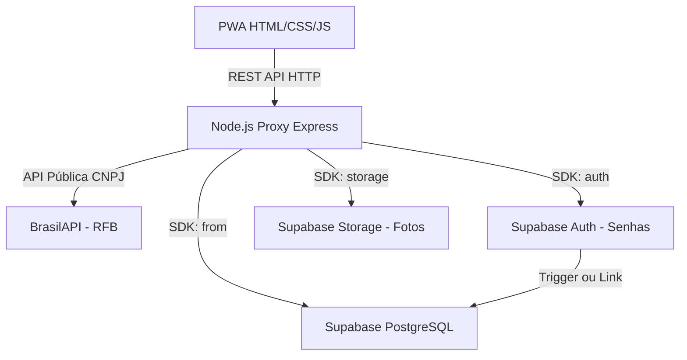

# Documento de Design de Software (SDD) - Universo do Carro (V2)

Este documento foi atualizado para descrever a nova arquitetura e a stack tecnológica de nuvem do projeto **Universo do Carro**, uma plataforma de cotação de peças automotivas.

## 1. Visão Geral da Arquitetura (Pós-Migração)

O sistema evoluiu de uma arquitetura estritamente local (SQLite) para uma infraestrutura orientada a nuvem utilizando plataforma **BaaS (Backend as a Service)**. O servidor Node.js atua agora principalmente como um Gateway/Proxy, orquestrando requisições entre o Front-end e o Supabase, injetando segurança de chaves de administração no backend e conectando a BrasilAPI.

## 2. Tecnologias e Camadas Verificadas (Stack)

### 2.1 Backend Proxy (Servidor Local/Hospedável)
- **Linguagem / Runtime:** JavaScript (Node.js)
- **Framework Web:** Express.js (v5.2.1)
- **Integração de Nuvem:** `@supabase/supabase-js`
- **Operação Sensível:** Utiliza a `Service Role Key` para autorizar a gestão de tabelas sob RLS (Row Level Security) servindo o Frontend de forma unificada.

### 2.2 Banco de Dados e Armazenamento (Supabase Nuvem)
- **Sistema de Gerenciamento:** PostgreSQL (gerenciado pelo Supabase).
- **Tabelas Principais:**
  - `auth.users`: Tabela interna blindada gerida integralmente pela infraestrutura do Supabase, retém o e-mail, senhas em `bcrypt` e gerencia a sessão de segurança (tokens).
  - `public.profiles`: Armazena dados de expansão vinculados à auth (nome, permissão de motorista vs lojista, CNPJ, cidade, telefone).
  - `public.cotacoes`: Registra pedidos de peças requeridas.
  - `public.ofertas`: Lances financeiros inseridos pelas lojas respondendo à cotações.
- **Armazenamento de Arquivos:** Substituição do upload via sistema local (fs) para injeção através da RAM de buffers diretamente no Bucket público `uploads` do Supabase Storage.

### 2.3 Frontend (Cliente)
- **Tecnologias:** HTML5, CSS Vanilla, JavaScript (Vanilla).
- **Progressive Web App (PWA):**
  - Conta com um arquivo de manifesto (`manifest.json`) mantendo o contexto de "App" nativo para o cliente final.
  - Suporta cache passivo e eventuais notificações em background via `sw.js`.
- **Evoluções Próximas (Futuro):** Recomenda-se a migração progressiva da autenticação e buscas de dados para o client-side (chamando o SDK do Supabase diretamente dentro do `loja.html`), o que poderá matar a necessidade do Proxy (Node.JS) com o tempo.

### 2.4 Integrações Externas Ativas
- **Validação de CNPJ:** O servidor consome a **BrasilAPI** para barrar inscrições inativas na receita, gerando integridade e autoridade à plataforma antes mesmo de inserir os dados no Supabase.

## 3. Fluxo de Dados Atualizado (Cotação e Venda)

1. **Solicitação de Cadastro:** O Front-end bate no `/api/register`. O Node.js checa o CNPJ. Se válido, o Node manda o Supabase criar um Auth seguro (`createUser`) e imediatamente injeta informações adicionais na tabela de `profiles`.
2. **Postagem de Cotação:** Comprador insere detalhes em `cotacao.html`. Se houver foto, o backend usa o `multer.memoryStorage()` para captar o arquivo binário em tempo real e joga no Bucket Cloud do Supabase, repassando o link retornado para o PostgreSQL (`foto_url`).
3. **Mesa de Lances:** A PWA do Lojista consulta a rota e o servidor puxa do PostgreSQL (fazendo join das tabelas `cotacoes` e `profiles` para puxar dados do cliente simultaneamente). Lojista envia proposta no `/api/ofertas`.
4. **Fechamento:** O Fluxo visual é identicamente transparente. O banco de dados da nuvem registra a tabela para 'Concluído' e libera o telefone seguro entre os dois interessados.
